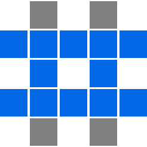

<a name="readme-top"></a>

<!-- PROJECT LOGO -->
<br />
<div align="center">
  <a href="https://github.com/haemie/supertictactoe">
    
  </a>

  <h3 align="center">Super Tic Tac Toe</h3>
</div>

<!-- ABOUT THE PROJECT -->

## About The Project

Tic tac toe, where each move determines the next player's move. See this [VSauce video](https://www.youtube.com/shorts/_Na3a1ZrX7c) for full ruleset.
The game state is currently handled on the frontend. Backend is planned to hold its own instance of game state, and will receive each player's move, validate the move, and then send it to the next player.

Currently deployed to https://haemie.github.io/supertictactoe/

<p align="right">(<a href="#readme-top">back to top</a>)</p>

### Frontend Built With

- React
- Vite

### Backend Built With

- Express
- Socket.io

<p align="right">(<a href="#readme-top">back to top</a>)</p>

<!-- GETTING STARTED -->

## Getting Started

To get a local copy up and running follow these simple example steps.

### Prerequisites

- node
- npm

### Installation

1. Clone the repo
   ```sh
   git clone https://github.com/haemie/supertictactoe.git
   ```
2. Install NPM packages
   ```sh
   npm install
   ```

3. Install client packages
   ```sh
   cd client
   npm install
   ```
   
4. Install server packages
   ```sh
   cd ../server
   npm install
   ```

<p align="right">(<a href="#readme-top">back to top</a>)</p>

### Testing

1. Open Cypress

   ```npx cypress open

   ```

2. Install NPM packages
   ```sh
   npm install
   ```

<p align="right">(<a href="#readme-top">back to top</a>)</p>

<!-- ROADMAP -->

## Roadmap

- [ ] general styling improvements
- [ ] implement online multiplayer
- [ ] implement minimax ai

<p align="right">(<a href="#readme-top">back to top</a>)</p>

<!-- LICENSE -->

## License

Distributed under the MIT License. See `LICENSE.txt` for more information.

<p align="right">(<a href="#readme-top">back to top</a>)</p>
