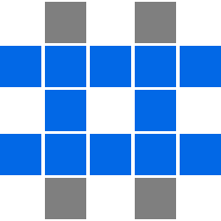

<a name="readme-top"></a>

<!-- PROJECT LOGO -->
<br />
<div align="center">
  <a href="https://github.com/haemie/supertictactoe">
    
  </a>

  <h3 align="center">Super Tic Tac Toe</h3>
</div>

<!-- ABOUT THE PROJECT -->

## About The Project

Play the current build [here](https://main--unrivaled-longma-b1ad92.netlify.app/).

<p align="right">(<a href="#readme-top">back to top</a>)</p>

### Built With

- React
- Vite

<p align="right">(<a href="#readme-top">back to top</a>)</p>

<!-- GETTING STARTED -->

## Getting Started

To get a local copy up and running follow these simple example steps.

### Prerequisites

- yarn
  ```sh
  npm install yarn -g
  ```

### Installation

1. Clone the repo
   ```sh
   git clone https://github.com/haemie/supertictactoe.git
   ```
2. Install NPM packages
   ```sh
   npm install
   ```

<p align="right">(<a href="#readme-top">back to top</a>)</p>

<!-- ROADMAP -->

## Roadmap

- [x] option to change game dimensions
  - [ ] add better scaling with different dimensions
- [x] add specific colors for 'X' and 'O'
- [ ] general styling improvements
- [x] lift state out of components
- [ ] add online multiplayer
- [ ] add singleplayer

<p align="right">(<a href="#readme-top">back to top</a>)</p>

<!-- LICENSE -->

## License

Distributed under the MIT License. See `LICENSE.txt` for more information.

<p align="right">(<a href="#readme-top">back to top</a>)</p>
